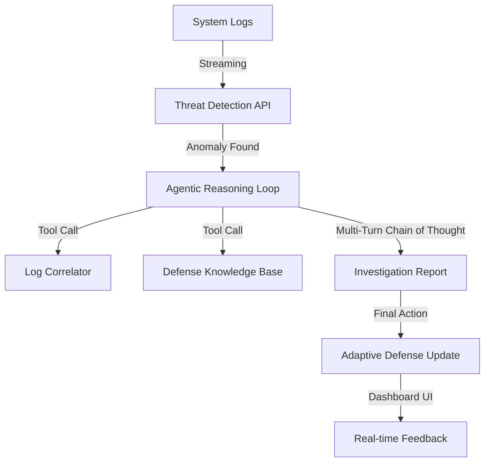

# 🏗️ System Architecture - Elyaitra

## **Project Theme:** Agentic AI Cybersecurity Defense

---

## **1. Core Infrastructure**

The system is designed as a **decentralized SecOps assistant**. It leverages **Groq's LPU (Language Processing Unit)** technology to ensure near-instant inference, allowing the agent to react to security threats in milliseconds.

### **Diagram (Conceptual Flow)**

---

## **2. Key Components**

### **A. Inference Engine (Groq & Gemini)**
- **Role**: The brain of the agent.
- **Workflow**:
  - The detection engine (First Pass) uses high-speed **Groq (llama-3.3-70b)** for lightning-fast analysis.
  - The investigation engine (Second Pass) uses the same reasoning-capable model to execute "multi-turn investigation."

### **B. Data Pipeline (RAG + Contextualization)**
- **Role**: Provides the agent with the "memory" of past attacks and organizational security policies.
- **Tools**:
  - **ChromaDB**: Stores the syllabus/policy artifacts for retrieval.
  - **Semantic Search**: Used by the agent to find similar historical threat patterns.

### **C. Frontend (Real-time Dashboard)**
- **Role**: Visualizes the agent's "thinking process" for human operators.
- **Features**:
  - **Live Threat Ticker**: Real-time analysis of streaming logs.
  - **Investigation Replay**: Shows the step-by-step logic the agent followed.
  - **Defense Evolution Graph**: Shows how the system's "immune system" is strengthening over time.

---

## **3. Agentic Loop Logic**

The agent operates on an **Interpret → Reason → Act** cycle:

1.  **Interpret**: Decodes incoming logs and identifies attack signatures (e.g., recursive directory traversal in web logs).
2.  **Reason**: Asks, "Is this a known security test or an actual exploit attempt?"
3.  **Act**: If an exploit is confirmed, it generates a "Response Script" and provides an automated defense update.

---

## **4. Scalability & Deployment**

- **Inference Latency**: Leverages Groq for sub-second agentic reasoning.
- **Local Deployment**: Using `npx next dev` and provided environment variables.
- **Containerization**: Backend and frontend can be containerized using the provided Dockerfile for enterprise-grade SecOps.
